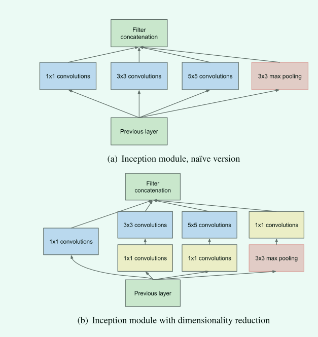
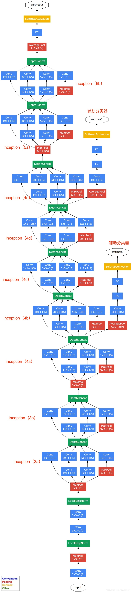
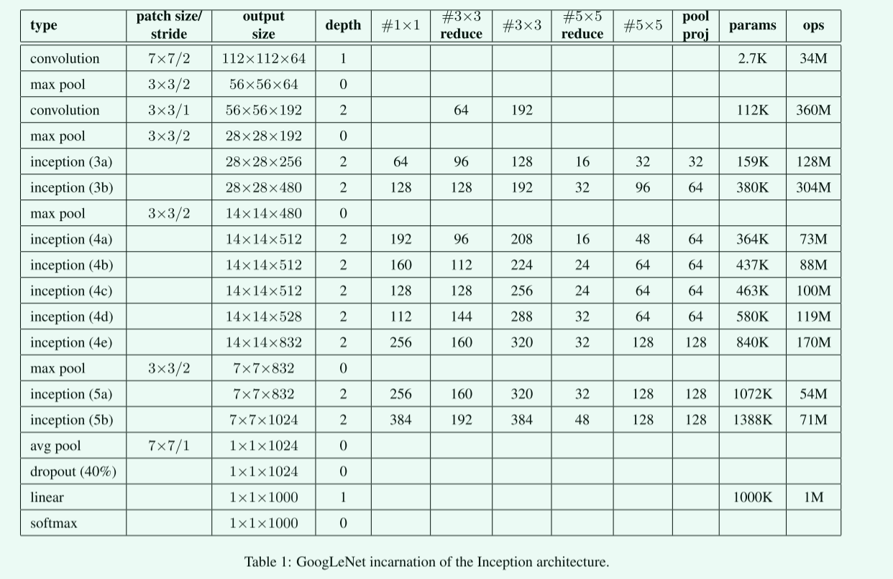

# Going deeper with convolutions(GoogleNet)

## 1 主要内容

"`Going deeper with convolutions`" 是一篇由`Google Research`团队在`2014`年发表在`CVPR`会议的论文。该论文提出了一个基于卷积神经网络（`CNN`）模型的新方法，以进一步提高图像识别和分类精度。

论文主要内容如下：

1. 首先，该论文提出了一个名为“可视化”的技术，可以通过将卷积层输出图像化，来更好地理解卷积神经网络的工作原理，以及在此过程中可以优化网络结构。

2. 其次，文章针对传统卷积神经网络模型，即使用堆叠的小型滤波器的方式逐层加深网络，提出了一个新的模型结构，即使用更大的滤波器并减少池化数量，增加卷积层数来达到更好的效果，这种新的模型被称为深度卷积神经网络（`Deep Convolutional Neural Network`, 或`Deep CNN`）。

3. 接着，该论文还介绍了一种新的训练方法，即使用残余学习（`Residual Learning`），以更好地实现网络的深度，并避免梯度消失的问题。

4. 最后，该论文还进行了一系列的实验验证，证明了新的深度卷积神经网络模型在多个数据集上都具有比传统方法更好的性能，例如在`ImageNet`数据集上的`Top-5`错误率从`24%`降低到了`18%`。

"`Going deeper with convolutions`"这篇论文通过提出新的算法、模型结构和训练方法，展示了卷积神经网络的强大性能，并获得了广泛的关注和应用。


## 2 使用更深的卷积神经网络(`GoogleNet`)

### 2.1 主要创新

这篇论文的创新主要有以下几点：

1. 提出了一个新的卷积神经网络模型——`Inception`网络，该网络具有更低的模型复杂度和更高的准确性，有效解决了当时神经网络中的瓶颈问题，使得计算极大地减小，同时保证了准确率。

2. 引入了`1×1`的卷积核，该卷积核可以增加网络的非线性拟合能力，同时可以减少计算量和内存使用。

3. 对于一个高维的输入特征图，在传统的卷积神经网络中通常先进行降维再进行卷积，然后再进行升维恢复原来的特征图大小。而`Inception`网络则使用多个不同尺寸的卷积核并行地进行卷积操作，从而获得了不同大小的感受野，并通过池化层与一般的卷积层交替使用，降低昂贵的计算成本。

4. 将`Inception`网络结构应用到大规模的图像数据集上，如`ImageNet`数据集，证明了该模型比之前最优秀的模型有更好的分类精度。

总之，《Going Deeper with Convolution》这篇论文提出了一种新的卷积神经网络模型——Inception网络，并引入了1x1卷积核、多尺度卷积和普通卷积和池化的结合等技术，使得模型可训练的参数量和计算量都大大减小，同时分类精度也有了显著提高。

### 2.2 `Inception`网络模型


`Inception`架构的主要思想是考虑卷积网络的最优局部稀疏结构如何能够被容易获得的密集组件近似和覆盖。即利用不同大小的卷积核实现不同尺度的感知，如下图所示。



#### 2.2.1 `Naive Inception`

早期版本如图(`a`)所示，输入对应数据，分别通过`1x1`卷积核，`3x3`卷积核，`5x5`卷积核以及`3x3`的最大池化层，通过这三种不同的操作，以获取更广泛更细节的特征，最终将这四个操作的进行拼接得到总的输出。

从上面我们可以看出，`Inception`架构主要就是利用不同的卷积操作得到不同的特征图，然后对特征图进行拼接，将最终的特征进行汇总。

**然而`Naive Inception`有两个主要问题：**

- 首先，所有卷积层直接和前一层输入的数据对接，当前一层输入特征图规模较大时，即便是`5x5`卷积核，其中的计算量也很大；
- 其次，在`Naive Inception`中几个卷积核与最大池化层都保留了输入数据的特征图的深度，所以在最后进行合并时，总的输出的特征图的深度只会增加，这样增加了该单元之后的网络结构的计算量。

#### 2.2.2 `Inception module with dimensionality reduction`

为了解决`Naive Inception`版本存在的问题，作者提出了第二个版本，即`Inception module with dimensionality reduction`，其网络模型如上图(`b`)所示。

其改进方式如下：

- 针对上一层输入通道数较大时导致即便`5x5`卷积核的计算量也很大的问题，作者通过在大卷积核前面放置一个小卷积核，即`1x1`卷积核进行降维操作(这只是我为了方便描述的说法，即将输入的通道数降低，但由于卷积核会自动提取重要的对应特征图输出，因此在降低输出特征图的同时并不会对效果有较大影响)。再将降维后的输出的特征图输入给`5x5`大小的卷积核进行特征提取，以此降低计算量。
- 为了解决几个通道卷积或池化之后拼接的特征图数量过大的问题，在新版本中，作者在这几个通道都进行了相应设置，即所有通道进行特征提取之后，合并后的特征图数量大小等于输入之前的特征图数量。

>其中`1x1`卷积核在特征图进行卷积其实可以看作是一个线性激活变换。

这种结构的一个有用的方面是它允许显著地增加每一级的单元数目，而不会在后面的级中不受控制地放大计算复杂性。这是通过在具有较大面片尺寸的昂贵卷积之前普遍使用降维来实现的。此外，该设计遵循视觉信息应在不同尺度下处理然后聚合的实践直觉，以便下一阶段可以同时从不同尺度提取特征。

### 2.3 GoogLeNet

`GoogLeNet`的详细设计如下图所示。



#### 2.3.1 `Auxiliary Classifier`

从上图可以看出，相比于普通的深度学习网络，GoogLeNet具有三个输出，其中前两个是辅助分类器。

**辅助分类器的两个分支有什么用呢？**

**作用一：** 可以把他看做`inception`网络中的一个小细节，它确保了即便是隐藏单元和中间层也参与了特征计算，他们也能预测图片的类别，他在`inception`网络中起到一种调整的效果，并且能防止网络发生过拟合。
**作用二：** 给定深度相对较大的网络，有效传播梯度反向通过所有层的能力是一个问题。通过将辅助分类器添加到这些中间层，可以期望较低阶段分类器的判别力。在训练期间，它们的损失以折扣权重（辅助分类器损失的权重是`0.3`）加到网络的整个损失上。

其中主干`GoogLeNet`相关细节如下表所示。



### 2.4 `GoogLeNet`的实现

由于在`GoogLetNet`中，`inception`结构是一致的，因此我们可以先定义`inception`网络。

>需要注意的是在该网络中，所有的结构中都是使用的`Relu`激活函数进行激活。

**`inception`网络定义如下：**

```py
class Inception(nn.Module):
    def __init__(self, in_channels, c1, c2, c3, c4, **args):
        super(Inception, self).__init__(**args)
        self.conv1_1 = nn.Conv2d(in_channels, c1, kernel_size=1)
        self.conv2_1 = nn.Conv2d(in_channels, c2[0], kernel_size=1)
        self.conv2_2 = nn.Conv2d(c2[0], c2[1], kernel_size=3, padding=1)
        self.conv3_1 = nn.Conv2d(in_channels, c3[0], kernel_size=1)
        self.conv3_2 = nn.Conv2d(c3[0], c3[1], kernel_size=5, padding=2)
        self.pool4_1 = nn.MaxPool2d(kernel_size=3, stride=1, padding=1)
        self.conv4_2 = nn.Conv2d(in_channels, c4, kernel_size=1)
        self.relu = nn.ReLU()

    def forward(self, x):
        conv1 = self.relu(self.conv1_1(x))
        conv2 = self.relu(self.conv2_2(self.relu(self.conv2_1(x))))
        conv3 = self.relu(self.conv3_2(self.relu(self.conv3_1(x))))
        conv4 = self.relu(self.conv4_2(self.pool4_1(x)))
        return torch.cat((conv1, conv2, conv3, conv4), dim=1)
```

>这里是稍微有点问题，即在原论文中它是使用了一个5x5的卷积核，但在源码中，实际是使用3x3卷积核代替5x5卷积核，但这里我们依照原文。

**辅助分类器网络定义如下：**

```py
# 定义辅组分类器
class AuxClassifier(nn.Module):
    def __init__(self, in_channels, num_classes):
        super(AuxClassifier, self).__init__()
        self.averagePool = nn.AvgPool2d(kernel_size=5, stride=3)
        self.conv = nn.Conv2d(in_channels, 128, kernel_size=1)
        self.fc1 = nn.Linear(2048, 1024)
        self.fc2 = nn.Linear(1024, num_classes)
        self.relu = nn.ReLU(inplace=True)
        self.dropout = nn.Dropout(0.3)
 
    def forward(self, x):
        x = self.averagePool(x)
        x = self.relu(self.conv(x))
        x = torch.flatten(x, 1)
        x = self.dropout(x)
        x = self.relu(self.fc1(x))
        x = self.dropout(x)
        x = self.fc2(x)
        return x
```

**`GoogLeNet`网络定义如下：**

```py
class GoogLeNet(nn.Module):
	# 传入的参数中aux_logits=True表示训练过程用到辅助分类器，aux_logits=False表示验证过程不用辅助分类器
    def __init__(self, num_classes=1000, aux_logits=True, init_weights=False):
        super(GoogLeNet, self).__init__()
        self.aux_logits = aux_logits
        self.feature1 = nn.Sequential(
            nn.Conv2d(3, 64, kernel_size=7, stride=2, padding=3),
            nn.MaxPool2d(3, stride=2, padding=1),
            nn.ReLU(inplace=True),
            nn.LocalResponseNorm(5),
            nn.Conv2d(64, 64, kernel_size=1),
            nn.ReLU(inplace=True),
            nn.Conv2d(64, 192, kernel_size=3, padding=1),
            nn.MaxPool2d(3, stride=2, padding=1),
            nn.ReLU(inplace=True),
            # Inception输出时已经使用relu激活，因此后面不再需要使用
            Inception(192, 64, (96, 128), (16, 32), 32),
            Inception(256, 128, (128, 192), (32, 96), 64),
            nn.MaxPool2d(3, stride=2, padding=1),
            Inception(480, 192, (96, 208), (16, 48), 64)
        )
        self.feature2 = nn.Sequential(
            Inception(512, 160, (112, 224), (24, 64), 64),
            Inception(512, 128, (128, 256), (24, 64), 64),
            Inception(512, 112, (144, 288), (32, 64), 64)
        )
        self.feature3 = nn.Sequential(
            Inception(528, 256, (160, 320), (32, 128), 128),
            nn.MaxPool2d(3, stride=2, padding=1),
            Inception(832, 256, (160, 320), (32, 128), 128),
            Inception(832, 384, (192, 384), (48, 128), 128)
        )
 
        if self.aux_logits:
            self.aux1 = AuxClassifier(512, num_classes)
            self.aux2 = AuxClassifier(528, num_classes)

        self.classifier = nn.Sequential(
            nn.AvgPool2d(7, stride=1),
            nn.Dropout(0.4),
            nn.Flatten(),
            nn.Linear(1024, num_classes)
        )
 
    def forward(self, x):
        x = self.feature1(x)
        if self.training and self.aux_logits:    # eval model lose this layer
            aux1 = self.aux1(x)
        x = self.feature2(x)
        if self.training and self.aux_logits:    # eval model lose this layer
            aux2 = self.aux2(x)
        x = self.feature3(x)
        x = self.classifier(x)
        if self.training and self.aux_logits:   # eval model lose this layer
            return x, aux1, aux2
        return x
```

需要注意的是，在原论文中，使用到了辅助分类器，在计算损失时，辅助分类器的损失权重为`0.3`，因此我们需要对损失进行小小的改变，代码如下：

```py
#训练时有两个辅助分类器，因此一共输出3个结果，保存训练结果
logits, aux_logits1, aux_logits2 = model(inputs)
#计算损失和
#多分类情况通常使用cross_entropy(交叉熵损失函数), 而对于二分类问题, 通常使用sigmod
loss1 = crossLoss(logits, labels)
loss2 = crossLoss(aux_logits1, labels)
loss3 = crossLoss(aux_logits2, labels)
# 分别计算各分类器的损失，最后计算总损失，辅助分类器损失权重因子为0.3
loss = loss1 + loss2 * 0.3 + loss3 * 0.3
#反向传播
loss.backward()
```

>其中，`model`即为`GoogLeNet`实例。

上面代码是复现原论文在`ImageNet`测试集下的代码，输入图片尺寸为`224x224x3`，为了简单对`GoogLeNet`中的`inception`网络进行测试，在`code`文件夹下使用了缩减版`GoogLeNet`在`CIFAR100`数据集下的测试，其中缩减了辅助分类器和大部分的`inception`网络，详细代码见`code`文件夹下的`GoogLeNet.py`。

## 3 参考文献
[1] C. Szegedy et al., "Going deeper with convolutions," 2015 IEEE Conference on Computer Vision and Pattern Recognition (CVPR), Boston, MA, USA, 2015, pp. 1-9, doi: 10.1109/CVPR.2015.7298594.