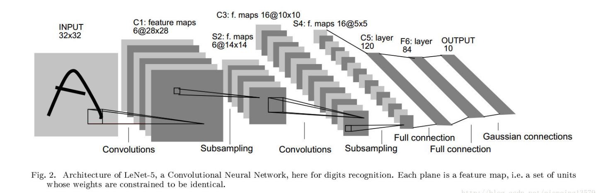
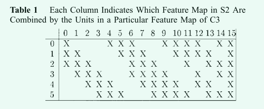
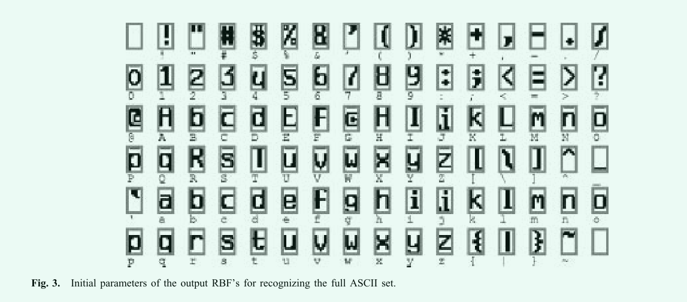
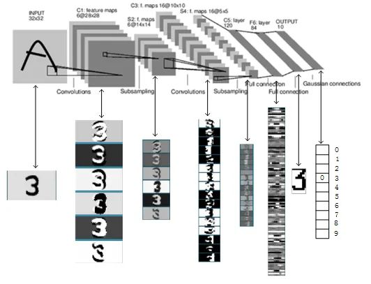

# Gradient-based learning applied to document recognition(LeNet-5)

## 1.主要内容

在《Gradient-Based Learning Applied to Document Recognition》这篇论文中，作者使用**LeNet-5**模型来进行手写数字字符识别任务。**LeNet-5**模型的设计是针对图像识别任务而设计的，具有多层卷积层和全连接层，能够有效地提取图像特征。在手写数字字符识别任务中，**LeNet-5**模型可以帮助将输入的手写数字字符图像转化为特征向量，并用于分类任务。通过使用**LeNet-5**模型，作者在手写数字字符识别任务上取得了较好的识别效果，证明了卷积神经网络在文档识别任务中的有效性。

文章篇幅很长，本文只针对**LeNet-5**进行描述，因此介绍着重点在文章的第二章节。

## 2.一种用于字符识别的卷积神经网络(LeNet-5)

### 2.1 什么是卷积神经网络

卷积神经网络（`Convolutional Neural Network, CNN`）是一种前馈神经网络，它可以有效地处理具有网格结构的数据，例如图像、声音和文本等。`CNN`通过卷积层（`Convolutional Layer`）和池化层（`Pooling Layer`）的交替使用，来提取输入数据的特征。卷积层通过卷积操作来捕捉输入数据的局部特征，池化层则通过降采样的方式来减小特征图的尺寸。最后，将提取的特征输入到全连接层（`Fully Connected Layer`）进行分类或回归等任务。

相较于传统的神经网络，卷积神经网络具有以下优点：
1. **卷积层（`Convolutional Layer`）**
   - **参数共享(`Parameter Sharing`)**：卷积层的每个过滤器都可以在整个输入数据上共享，从而大大减少了模型的参数数量，降低了过拟合的风险。

    - **局部连接(`Local Connectivity`)**：卷积层中的每个神经元只会连接到输入数据的一小部分，从而可以更好地捕捉输入数据的局部特征。

3. **池化层(`Pooling Layer`)**：池化层通过对特征图的降采样，减小了模型的计算复杂度，同时也可以减少模型对输入数据的噪声和变形的敏感性。

>在原论文中被称为**局部感受野(`local receptive fields`)**、**权重共享(`shared weights`)**以及**空间或时间子采样(`spatial or temporal subsampling`)**。

卷积神经网络通过卷积和池化实现图像在一定程度上的位移，缩放，和形变不变性。

#### 2.1.1 卷积层工作原理

示例图与描述待补充.......

#### 2.1.2 池化层工作原理

示例图与描述待补充.......

### 2.2 为什么在字符识别中使用卷积神经网络替代全连接神经网络

首先，`CNN`可以更好地利用图像的局部结构信息，从而提高模型的准确性和泛化能力。

其次，在全连接网络中，每个神经元都与前一层的所有神经元相连，这样会导致参数数量过多，容易出现过拟合的问题。而在`CNN`中，卷积层和池化层可以共享权重，从而减少参数数量，提高模型的泛化能力。此外，卷积层可以提取图像的局部特征，而池化层可以对特征进行下采样，从而进一步减少参数数量，提高模型的效率。

最后，在数字识别中，图像中的数字通常具有一定的局部结构，例如数字的边缘、角落等。使用`CNN`可以更好地利用这些局部结构信息，从而提高模型的准确性。此外，`CNN`还可以通过多个卷积层和池化层来提取更高层次的特征，从而进一步提高模型的准确性和泛化能力。

因此，在数字识别中使用卷积神经网络替代全连接网络可以更好地利用图像的局部结构信息，减少参数数量，提高模型的准确性和泛化能力。

### 2.3 什么是LeNet-5



`LeNet-5`是`CNN`的一种，其网络结构如上图所示。其中，`LeNet-5`共有`7`层(输入层除外)，其中每层都包含可训练参数（连接权重）。在论文所给出的LeNet-5结构图中输入图像大小为`32*32`。这要比`Mnist`数据库中的字母图像更大(`28*28`)。这样做的原因是希望潜在的明显特征如笔画端点或角点能够出现在最高层特征监测器感受野的中心。

下面将细致的介绍`LeNet-5`的组成，为了阐述的方便，下面的描述中，卷积层使用`Cx`指代,下采样层(即池化层)使用`Sx`指代,全连接层使用`Fx`指代,其中`x`代表对应层的索引。

>注意，`x`代表第几层。

### 2.3.1 `C1`层

`C1`层是一个卷积层，使用6个$5\times 5$大小的卷积核，`padding=0`，`stride=1`进行卷积操作，最终得到`6`个$28\times 28$的特征图(`Feature Map`)。

>输出大小计算公式：
$$
O=\frac{H+2P-F}{S}+1
$$
其中`O`是输出大小，`H`为输入的宽或者高，`F`为卷积核的对应大小，`P`为`padding`，即填充大小，`S`为`stride`。

**参数数目计算：** 由上可知`C1`由六个卷积核组成，每个卷积核中包含`(5*5)+1=26`个参数，一共有六个卷积核，因此一共有`26*6=156`个参数。

>其中`5*5`为卷积核中的参数`w`，额外加`1`指每个卷积核的偏置项`b`。

**连接数目计算：** 由于最终输出图像为$28\times 28$，因此每个卷积核中的参数需要进行`28*28`次卷积连接，一共有`6`个卷积核，因此总计有`26*28*28*6=122304`次连接。

### 2.3.2 `S2`层

`S2`层是一个下采样层，使用`6`个$2\times 2$大小的卷积核进行池化操作，其中`padding=0,stride=2`，得到`6`个$14\times 14$大小的特征图。

>池化层输出计算：
$$
O=\frac{H-F}{S}+1
$$
其中`O`是输出大小，`H`为输入的宽或者高，`F`为卷积核的对应大小，`S`为`stride`。

`S2`层其实相当于降采样层+激活层。先是降采样，然后激活函数`sigmoid`非线性输出。先对`C1`层`2x2`的视野求和，然后进入激活函数，即：
$$
sigmoid(\omega \dot{\sum_{i=1}^4{x_i}}+b)
$$

**参数数目计算：** 由于池化层只会对池化区域内的最大的那个数字进行计算，后再加上一个偏置，因此一个池化层只有`(1+1)`个参数，一共有`6`个池化卷积核，总共有`(1+1)*6=12`个参数。

>其中第一个 `1` 为池化对应的 `2*2` 感受野中最大的那个数的权重 `w`，第二个 `1 `为偏置 `b`。

**连接数目计算：** 虽然只选取 `2*2`感受野中的一个作为参数，但也存在`2*2`的连接数，`1`为偏置项的连接，每一个像素都由前面卷积得到，而输出特征层大小为`14*14`，即总共经历 `14*14` 次卷积,因此一共有`(2*2+1)*6*14*14= 5880`次连接。

### 2.3.3 `C3`层

`C3`层是卷积层，使用`16`个`5×5xn`大小的卷积核，`padding=0，stride=1`进行卷积，根据卷积计算(`14-5+1=10`)，最终得到`16`个`10×10`大小的特征图。

>需要说明的是：`16`个卷积核并不是都与`S2`中得到的`6`个通道层进行卷积操作，而是按照下图进行卷积(其中横轴数字代表对应卷积核下标，纵轴数字代表`S2`得到的`6`个通道层下标)。`C3`的前六个特征图`(0,1,2,3,4,5)`由`S2`的相邻三个特征图作为输入，对应的卷积核尺寸为：`5x5x3`；接下来的`6`个特征图`(6,7,8,9,10,11)`由`S2`的相邻四个特征图作为输入对应的卷积核尺寸为：`5x5x4`；接下来的`3`个特征图`(12,13,14)`号特征图由`S2`间断的四个特征图作为输入对应的卷积核尺寸为：`5x5x4`；最后的 `15` 号特征图由`S2`全部(`6` 个)特征图作为输入，对应的卷积核尺寸为：`5x5x6`。

>当然，也可以按照卷积核来理解，如第`1`个卷积核与`(0, 1, 2)`三个通道层进行卷积，此时卷积核大小为`5x5x3`；第`6`个卷积核与`(0, 1, 2, 3)`四个通道层进行卷积，此时卷积核大小为`5x5x4`；以此类推。



>再次提醒，卷积核是`5×5`且具有多个通道，每个通道各不相同，这也是下面计算时`5*5`后面还要乘以`3,4,6`的原因。这是多通道卷积的计算方法。

**参数数目计算：** 从图中可以看出，`3`通道卷积核有`6`个，`4`通道卷积核有`9`个，`6`通道卷积核有`1`个，外加每个卷积核都具有一个偏置项`b`。总共参数数目为`(5*5*3+1)*6+(5*5*4+1)*9+(5*5*6+1)*1=1516`

**连接数目计算：** 每个参数都对应输出层中的一个像素，因此总的连接数为:`1516*10*10 = 151600`。

### 2.3.4 `S4`层

`S4`层与`S2`一样也是降采样层，使用 `16` 个 `2×2` 大小的卷积核进行池化，`padding=0，stride=2`，得到 `16` 个 `5×5`大小的特征图`(10/2=5)`。

**参数数目计算：** 与上面计算类似，总参数数目为：`(1+1)*16=32`。

**连接数目计算：** `(2*2+1)*16*5*5= 2000`。

### 2.3.5 `C5`层

`C5` 层是卷积层，使用 `120` 个 `5×5x16` 大小的卷积核，`padding=0，stride=1`进行卷积，得到 `120` 个 `1×1` 大小的特征图：`5-5+1=1`。即相当于 `120` 个神经元的全连接层。

>值得注意的是，与`C3`层不同，这里`120`个卷积核都与`S4`的`16`个通道层进行卷积操作。

**参数数目计算：** `(5*5*16+1)*120=48120`。

**连接数目计算：** `48120*1*1=48120`。

### 2.3.6 `F6`层

`F6` 是全连接层，共有 `84` 个神经元，与 `C5` 层进行全连接，即每个神经元都与 `C5` 层的 `120` 个特征图相连。计算输入向量和权重向量之间的点积，再加上一个偏置，结果通过 `sigmoid` 函数输出。

`F6` 层有 `84` 个节点，对应于一个 `7x12` 的比特图，`-1` 表示白色，`1` 表示黑色，这样每个符号的比特图的黑白色就对应于一个编码。该层的训练参数和连接数是`(120 + 1)x84=10164`。`ASCII` 编码图如下：



**参数数目计算：** `(120+1)*84=10164`。

**连接数目计算：** `(120+1)*84=10164`。

### 2.3.7 `Output`层

最后的`Output`层也是全连接层，是 `Gaussian Connections`，采用了 `RBF`函数(即径向欧式距离函数)，计算输入向量和参数向量之间的欧式距离（目前已经被`Softmax`取代）。

`Output`层共有`10`个节点，分别代表数字 `0` 到 `9`。假设x是上一层的输入，`y` 是`RBF`的输出，则 `RBF` 输出的计算方式是：

$$
y_i=\sum_{j=0}^{83}({x_j-w_{ij}})^2
$$

上式中`i`取值从 `0` 到 `9`，`j` 取值从 `0` 到 `7*12-1`，`w` 为参数。`RBF` 输出的值越接近于 `0`，则越接近于 `i`，即越接近于 `i` 的 `ASCII` 编码图，表示当前网络输入的识别结果是字符 `i`。



**参数数目计算：** `84*10=840`。

**连接数目计算：** `84*10=840`。

## 2.4 LeNet-5网络的Pytorch实现

由于`RBF`复杂，且目前用于分类多使用`Softmax`以及`LogSoftmax`等作为分类损失计算，在本文的实现中吗，我们使用`LogSoftmax`作为最后的分类计算。

```python
import torch.nn as nn

class LeNet(nn.Module):
    def __init__(self):
        super(LeNet, self).__init__()
        self.conv1 = nn.Conv2d(1, 6, 5) 
        self.sigmoid = nn.Sigmoid()
        self.maxpool1 = nn.MaxPool2d(2, 2)
        self.conv2 = nn.Conv2d(6, 16, 5)
        self.maxpool2 = nn.MaxPool2d(2, 2)
        self.fc1 = nn.Linear(16*5*5, 120)
        self.fc2 = nn.Linear(120, 84)
        self.fc3 = nn.Linear(84, 10)
        self.logSoftmax = nn.LogSoftmax(dim=1)


    def forward(self, input):
        x = self.conv1(input)
        x = self.maxpool1(x)
        x = self.sigmoid(x)
        x = self.conv2(x)
        x = self.maxpool2(x)
        x = x.view(-1, 16*5*5)
        x = self.sigmoid(self.fc1(x))
        x = self.sigmoid(self.fc2(x))
        x = self.fc3(x)
        output = self.logSoftmax(x)
        return output
```

>完整`code`见对应文件夹下的`code`文件夹内！

## 2.5 总结

`LeNet-5` 与现在通用的卷积神经网络在某些细节结构上还是有差异的，例如 `LeNet-5` 采用的激活函数是 `sigmoid`，而目前图像一般用 `tanh`，`relu`，`leakly relu` 较多；`LeNet-5` 池化层处理与现在也不同；多分类最后的输出层一般用 `softmax`，与 `LeNet-5 `不太相同。

`LeNet-5` 是一种用于手写体字符识别的非常高效的卷积神经网络。`CNN` 能够得出原始图像的有效表征，这使得 `CNN` 能够直接从原始像素中，经过极少的预处理，识别视觉上面的规律。然而，由于当时缺乏大规模训练数据，计算机的计算能力也跟不上，`LeNet-5` 对于复杂问题的处理结果并不理想。

# 3 参考文献

[1]Y. LeCun, L. Bottou, Y. Bengio, and P. Haffner, "Gradient-Based Learning Applied to Document Recognition," Proceedings of the IEEE, vol. 86, no. 11, pp. 2278-2324, Nov. 1998.
[2]Y. LeCun, I. Kanter, and S. Solla, “Eigenvalues of covariance matrices: Application to neural-network learning,” Phys. Rev. Lett., vol. 66, no. 18, pp. 2396–2399, May 1991. 