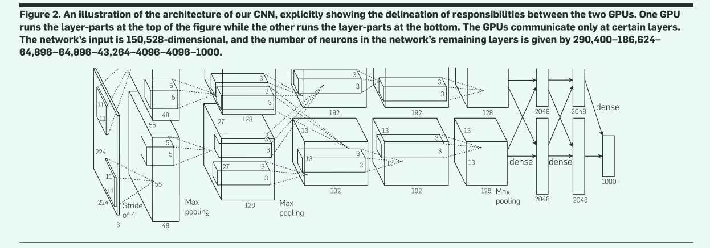
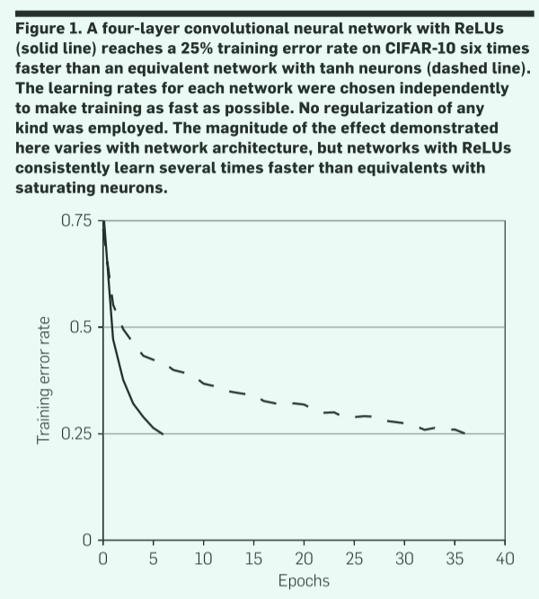
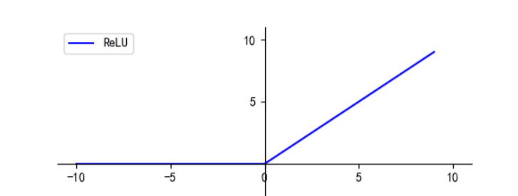

# ImageNet Classification with Deep Convolutional Neural Networks(AlexNet)

## 1. 主要内容

这篇文章是由`Alex Krizhevsky`、`Ilya Sutskever`和`Geoffrey Hinton`发表在`2012`年的论文。文章主要介绍了使用深度卷积神经网络（`CNN`）进行图像分类的方法，并在`ImageNet`数据集上取得了当时最好的结果。具体来说，文章介绍了使用深度卷积神经网络（`CNN`）对`ImageNet`数据集进行训练和分类的过程。

`CNN`是一种特殊的神经网络架构，其核心思想是通过多层卷积和池化操作来提取图像特征，并通过全连接层进行分类。文章中所使用的`CNN`网络结构被称为`AlexNe`t，包含`5`个卷积层和`3`个全连接层，总共有`60`亿个参数。

通过在`ImageNet`数据集上进行训练和测试，`AlexNet`在`2012`年的`ImageNet`挑战赛上取得了当时最好的结果，将错误率降低了`10`个百分点，达到了`15.3%`。这个结果彻底改变了计算机视觉领域的研究方向，使得深度学习成为了图像分类等任务的主流方法。

除了介绍`CNN`模型的训练和分类过程外，文章还详细介绍了一些优化技术，如 **`dropout`** 、**数据增强**和**多GPU并行训练**等，这些技术可以提高模型的精度和训练速度。

总的来说，《`ImageNet Classification with Deep Convolutional Neural Networks`》这篇文章对深度学习和计算机视觉领域的发展产生了深刻的影响，奠定了深度学习在图像分类等任务中的地位。

## 2.一种用于`ImageNet`分类的深度卷积神经网络(AlexNet)

### 2.1 主要创新点

- **深度：** `AlexNet`是一个深度卷积神经网络，它包含了`5`个卷积层和`3`个全连接层，总共有`60`亿个参数。这是当时(`2012`)最大的神经网络之一。

- **非线性激活函数：** `AlexNet`使用了`ReLU`（`Rectified Linear Unit`）作为激活函数，它比传统的`sigmoid`函数更加快速和容易训练。在`AlexNet`中，`ReLU`被引入到每个卷积层和全连接层之后，以增加模型的非线性。

- **局部响应归一化（`LRN`）：** `AlexNet`使用了`LRN`技术来增强模型的泛化能力。`LRN`在每个卷积层之后进行操作，它可以通过抑制相邻神经元的响应来帮助防止过度拟合。

- **数据增强：** `AlexNet`使用了数据增强技术来扩大训练集。这包括对训练图像进行随机剪裁、水平翻转、随机调整亮度和对比度等操作，以增加模型的鲁棒性和泛化能力。

- **Dropout：** `AlexNet`还使用了`dropout`技术来防止过度拟合。在训练过程中，`dropout`会随机将部分神经元的输出设置为零，以强制模型学习更加鲁棒和泛化的特征。

- **可视化：** `AlexNet`还使用了可视化技术来分析模型学到的特征。通过对第一个卷积层中的滤波器进行可视化，研究人员发现模型学到的是一些基本的图像特征，如边缘和纹理。

综上所述，`AlexNet`的创新点是多方面的，包括**深度**、**非线性激活函数**、**局部响应归一化**、**数据增强**、**`dropout`**和**可视化**等。这些创新点使得`AlexNet`成为了当时最先进的图像分类模型之一，为深度学习的发展开辟了新的道路。

下面将一一介绍其中的创新点。

## 2.2 AlexNet的深度



在`AlexNet`中，一共有`8`层，前`5`层是卷积层，后`3`层是全连接层，其中交叠着池化层和对应激活函数。

下面将细致的介绍`AlexNet`的组成，为了阐述的方便，下面的描述中，卷积层使用`Cx`指代,下采样层(即池化层)使用`Sx`指代,全连接层使用`Fx`指代,其中`x`代表对应层的索引。

>注意，`x`代表第几层。

### 2.2.1 `C1`层

`C1`层是一个卷积层，使用`96`个$11\times 11\times 3$大小的卷积核，`stride=4`的卷积操作对$224\times 224\times 3$图像进行卷积操作，最终得到`96`个$55\times 55$的特征图(`Feature Map`)。

>**这里需要特别注意：** 上面是原论文中的描述，从结论反推，我们可以发现，输入经过对应卷积操作并不是上面描述的输出。根据输出公式:
$$
O=\frac{H+2P-F}{S}+1
$$
其中`O`是输出大小，`H`为输入的宽或者高，`F`为卷积核的对应大小，`P`为`padding`，即填充大小，`S`为`stride`。
我们可以反推得到$H+2P=227$，因此有两种情况，
**第一：** 输入图像为`225`大小，`padding=1`；
**第二：** 输入图像大小本身就是`227`。
但这并不影响我们计算该层的连接数和参数。

**参数数目计算：** 由上可知`C1`由`96`个卷积核组成，每个卷积核中包含`(11*11*3)+1=364`个参数，一共有`96`个卷积核，因此一共有`364*96=34944`个参数。

>其中`11*11*3`为卷积核中的参数`w`，额外加`1`指每个卷积核的偏置项`b`。

**连接数目计算：** 由于最终输出图像为$55\times 55$，因此每个卷积核中的参数需要进行`55*55`次卷积连接，一共有`96`个卷积核，因此总计有`55*55*96=290400`次连接。

### 2.2.2 `S2`层

`S2`层是一个下采样层，使用`96`个$3\times 3$大小的卷积核对$55\times 55$大小的特征图进行池化操作，其中`padding=0,stride=2`，得到`96`个$27\times 27$大小的特征图。

>池化层输出计算：
$$
O=\frac{H-F}{S}+1
$$
其中`O`是输出大小，`H`为输入的宽或者高，`F`为卷积核的对应大小，`S`为`stride`。

`S2`层其实相当于降采样层+激活层。先是降采样，然后激活函数`relu`非线性输出。先对`C1`层`2x2`的视野求和，然后进入激活函数，即：
$$
relu(\omega \dot{\sum_{i=1}^4{x_i}}+b)
$$

**参数数目计算：** 由于池化层只会对池化区域内的最大的那个数字进行计算，后再加上一个偏置，因此一个池化层只有`(1+1)`个参数，一共有`96`个池化卷积核，总共有`(1+1)*96=192`个参数。

>其中第一个 `1` 为池化对应的 `3*3` 感受野中最大的那个数的权重 `w`，第二个 `1` 为偏置 `b`。

**连接数目计算：** 虽然只选取 `3*3`感受野中的一个作为参数，但也存在`3*3`的连接数，`1`为偏置项的连接，每一个像素都由前面卷积得到，而输出特征层大小为`27*27`，即总共经历 `27*27` 次卷积,因此一共有`(3*3+1)*96*27*27= 699840`次连接。

### 2.2.3 `C3`层

`C3`层是一个卷积层，使用`256`个$5\times 5\times 48$大小的卷积核，`padding=2，stride=1`的卷积操作对$27\times 27\times 96$图像进行卷积操作，最终得到`256`个$27\times 27$的特征图(`Feature Map`)。

**参数数目计算：** 由上可知`C3`由`128`个卷积核组成，每个卷积核中包含`(5*5*48)+1=1201`个参数，一共有`256`个卷积核，因此一共有`1201*256=307456`个参数。


**连接数目计算：** 由于最终输出图像为$27\times 27$，因此每个卷积核中的参数需要进行`27*27*48`次卷积连接，一共有`128`个卷积核，因此总计有`27*27*48*256=8957952`次连接。

### 2.2.4 `S4`层

`S4`层是一个下采样层，使用`256`个$3\times 3$大小的卷积核对$27\times 27$大小的特征图进行池化操作，其中`padding=0,stride=2`，得到`256`个$13\times 13$大小的特征图。

**参数数目计算：** 一个池化层有`(1+1)`个参数，一共有`256`个池化卷积核，总共有`(1+1)*256=512`个参数。


**连接数目计算：** 每个池化卷积核存在`3*3`的连接数，`1`为偏置项的连接，每一个像素都由前面卷积得到，而输出特征层大小为`13*13`，即总共经历 `13*13` 次卷积,因此一共有`(3*3+1)*256*13*13= 432640`次连接。

### 2.2.5 `C5`层

`C5`层是一个卷积层，使用`384`个$3\times 3\times 256$大小的卷积核，`padding=1，stride=1`的卷积操作对$13\times 13\times 128$图像进行卷积操作，最终得到`384`个$13\times 13$的特征图(`Feature Map`)。

**参数数目计算：** 由上可知`C5`由`384`个卷积核组成，每个卷积核中包含`(3*3*256)+1=2305`个参数，一共有`384`个卷积核，因此一共有`2305*384=885120`个参数。


**连接数目计算：** 由于最终输出图像为$13\times 13$，因此每个卷积核中的参数需要进行`13*13*256`次卷积连接，一共有`384`个卷积核，因此总计有`13*13*256*384=16613376`次连接。

### 2.2.6 `C6`层

`C6`层是一个卷积层，使用`384`个$3\times 3\times 192$大小的卷积核，`padding=1，stride=1`的卷积操作对$13\times 13\times 384$图像进行卷积操作，最终得到`384`个$13\times 13$的特征图(`Feature Map`)。

>此时`C6`层与`C5`层是直接相连的，并不需要经过池化或归一化。

**参数数目计算：** 由上可知`C6`由`384`个卷积核组成，每个卷积核中包含`(3*3*192)+1=1729`个参数，一共有`384`个卷积核，因此一共有`1729*384=663936`个参数。


**连接数目计算：** 由于最终输出图像为$13\times 13$，因此每个卷积核中的参数需要进行`13*13*192`次卷积连接，一共有`384`个卷积核，因此总计有`13*13*192*384=12460032`次连接。

### 2.2.7 `C7`层

`C7`层是一个卷积层，使用`256`个$3\times 3\times 192$大小的卷积核，`padding=1，stride=1`的卷积操作对$13\times 13\times 384$图像进行卷积操作，最终得到`256`个$13\times 13$的特征图(`Feature Map`)。

>此时`C7`层与`C6`层是直接相连的，并不需要经过池化或归一化。

**参数数目计算：** 由上可知`C7`由`256`个卷积核组成，每个卷积核中包含`(3*3*192)+1=1729`个参数，一共有`256`个卷积核，因此一共有`1729*256=442368`个参数。


**连接数目计算：** 由于最终输出图像为$13\times 13$，因此每个卷积核中的参数需要进行`13*13*192`次卷积连接，一共有`256`个卷积核，因此总计有`13*13*192*256=8306688`次连接。

### 2.2.8 `S8`层

`S8`层是一个下采样层，使用`256`个$3\times 3$大小的卷积核对$13\times 13$大小的特征图进行池化操作，其中`padding=0,stride=2`，得到`256`个$6\times 6$大小的特征图。

**参数数目计算：** 一个池化层有`(1+1)`个参数，一共有`256`个池化卷积核，总共有`(1+1)*256=512`个参数。


**连接数目计算：** 每个池化卷积核存在`3*3`的连接数，`1`为偏置项的连接，每一个像素都由前面卷积得到，而输出特征层大小为`6*6`，即总共经历 `6*6` 次卷积,因此一共有`(3*3+1)*256*6*6= 92160`次连接。

### 2.2.9 `F9`层

`F9` 是全连接层，共有 `4096` 个神经元，与 `S8` 层进行全连接，即每个神经元都与 `S8` 层的 `256` 个特征图相连。计算输入向量和权重向量之间的点积，再加上一个偏置，结果通过 `relu` 函数输出。

**参数数目计算：** `[(6*6+1)*256]*4096=38797312`。

**连接数目计算：** `[(6*6+1)*256]*4096=38797312`。

### 2.2.10 `F10`层

`F10` 是全连接层，与`F9`层结构一致，共有 `4096` 个神经元，与 `F9` 层进行全连接，即每个神经元都与 `F9` 层的 `4096` 个特征图相连。计算输入向量和权重向量之间的点积，再加上一个偏置，结果通过 `relu` 函数输出。

**参数数目计算：** `(4096+1)*4096=16781312`。

**连接数目计算：** `(4096+1)*4096=16781312`。

### 2.2.11 `Output`层

`Output` 是全连接层，，共有 `1000` 个神经元，与 `F10` 层进行全连接，即每个神经元都与 `F10` 层的 `4096` 个特征图相连。计算输入向量和权重向量之间的点积，再加上一个偏置，将结果经过`Softmax`计算结果并输出，根据输出概率分布确定图片的分类。

**参数数目计算：** `(4096+1)*1000=4097000`。

**连接数目计算：** `(4096+1)*1000=4097000`。


## 2.3 `Dropout`层

在全连接神经网络训练中，当在一定量数据中的训练次数过大，可能往往就会造成过拟合现象。为了解决该现象，Hinton等人提出了一种`Dropout`操作，指在神经网络的对应层中随机的忽略某些神经网络。以这种方式“`dropped out`”的神经元对前向传递没有贡献，并且不参与反向传播。所以每次输入出现时，神经网络都会对不同的架构进行采样，但所有这些架构都共享权重。这种技术减少了神经元复杂的相互适应，因为一个神经元不能依赖于其他特定神经元的存在。

因此，它被迫学习更鲁棒的特征，这些特征结合其他神经元的许多不同随机子集是有用的。

在本文中，作者在`F9`和`F10`之后都使用了`dropout`操作，并设置其输出乘以`0.5`，这是取指数级丢失网络产生的预测分布的几何平均值的合理近似。

## 2.4 `Relu`激活函数

在本文中，作者不再使用`sigmoid`函数作为激活函数，而是使用`relu`函数作为激活含函数，原因在于在进行反向传播时该函数的计算量更大，此外，`Relu`还能够更快的收敛。

下图显示了同一网络中分别使用`Relu`和使用`sigmoid`激活函数的收敛速度。很明显，使用`Relu`激活函数的神经网络收敛速度更快，能够在更短的时间内达到更高的准确度。



$$
Relu=max(0,x)
$$

函数图像如下：


**为什么要使用激活函数？**

要想掌握何时使用激活函数，则需要了解激活函数的作用。

- 激活函数作用

以全连接神经网络为例，在一个网络中，输入参数为$\pmb{x}$，经过第一层全连接网络计算(该全连接网络由参数$\pmb{\omega_1}$和偏置项$\pmb{b_1}$)，计算可知通过第一层神经网络后的输出为：

$$
\pmb{Output_1}=\pmb{x\omega_1+b_1}
$$

当没有激活函数时，假设此时第二层神经网络参数为$\pmb{\omega_2}$和偏置项$\pmb{b_2}$，而经过第二层的输出为：

$$
\pmb{Output_2}=\pmb{Output_2\omega_2+b_2} \\
=\pmb{(x\omega_1+b_1)\omega_2+b_2} \\
=\pmb{x\omega_1\omega_2+\omega_2b_1+b_2}
$$

此时，可以将$\pmb{\omega_1\omega_2}$看作一个整体，即为$\pmb{\omega}$，同理，$\pmb{\omega_2b_1+b_2}$看作一个整体即为$\pmb{b}$。

从上面我们可以看到，倘若不对输出进行非线性变换，则多个层进行连接和一个层训练的结果是一样的，因此我们需要在层与层连接处使用激活函数。

**在卷积中，应该何时使用激活函数？**

- 当使用的是最大或最小池化层时，优先在池化后进行激活，这样有利于减少计算量。

>其实在最大或最小池化层中，池化前进行激活和池化后进行激活效果是一样的，但后激活会大大减少计算量

- 当使用的是平均池化层时，建议先使用激活函数，然后再进行池化操作。

## 2.5 局部响应归一化(`Local response normalization, LRN`)

`ReLU`具有理想的特性，即它们不需要输入归一化来防止饱和。如果至少有一些训练样本对`ReLU`产生了积极的输入，那么学习就会在那个神经元中发生。

尽管如此，在`AlexNet`中，作者发现一种局部归一化操作仍然是对网络训练是有益的。局部归一化数学表达如下所示。

$$
b^i_{x,y}=\frac{a^i_{x,y}}{(k+\alpha\sum_{j=max(0,i-\frac{n}{2})}^{min(N-1,i+\frac{n}{2})}(a^j_{x,y})^2)^\beta}
$$

>其中$N$表示该层卷积核的总数目，$a^j_{x,y}$表示第$i$个卷积核，作用于位置$(x,y)$，然后通过`Relu`激活函数激活得到的输出；$n$表示同一位置上临近卷积核数量；$k,n,\alpha,\beta$为超参数。

`LRN`的直观解释就是，在第 `i` 个特征图上的` (x,y)` 出的神经元的值，通过其邻近的 `n`个特征图上，同一位置的值平方和的相关运算，最后得到的值作为该特征图上，对应位置的新值。

>在原论文中，超参数的的对应值为：$k=2,n=5,\alpha=10^{-4},\beta=0.75$

可想而知，其计算量不小！后面的研究者发现，`LRN`效果并不明显，反而增加不少的计算量，因此一般都不再使用。

## 2.6 交叠池化 (`Overlapping Pooling`)

在一般池化中，池化窗口`z`与滑动步长`s`相等。而交叠池化指的就是 `s < z` 的池化，此时相邻的滑窗之间会有重叠。在AlexNet的实现中，作者使用 `z=3,s=2` ，这时的发现错误率有了明显的降低。

同时作者发现，使用`overlapping pooling` 方式，更不易发生过拟合。

## 2.7 优化器的选择

在论文中，作者选取梯度下降(`Stochastic Gradient Descent,SGD`)作为模型优化器，同时学习率初始化为`0.01`，动量为`0.9`，动量衰减为`0.0005`.

## 2.4 AlexNet网络的Pytorch实现

>在上面的描述中，是整体的对网络进行描述，但在实际实现中，由于当时的算法不足，因此使用了并行`GPU`进行训练，即将模型拆分成两半，但在下面的实现中，我们将整体实现。

以下是使用PyTorch实现的AlexNet代码示例：

```python
import torch.nn as nn
class AlexNet(nn.Module):
    def __init__(self, num_classes=1000):
        super(AlexNet, self).__init__()
        self.features = nn.Sequential(
            nn.Conv3d(3, 96, kernel_size=(11*11*3), stride=4),
            nn.MaxPool3d(kernel_size=3, stride=2),
            nn.LocalResponseNorm(size=5, alpha=0.0001, beta=0.75, k=2),
            nn.ReLU(inplace=True),
            nn.Conv3d(96, 256, kernel_size=(5*5*48), stride=1, padding="same"),
            nn.MaxPool3d(kernel_size=3, stride=2),
            nn.LocalResponseNorm(size=5, alpha=0.0001, beta=0.75, k=2),
            nn.ReLU(inplace=True),
            nn.Conv3d(256, 384, kernel_size=(3*3*256), stride=1, padding="same"),
            nn.ReLU(inplace=True),
            nn.Conv3d(384, 384, kernel_size=(3*3*192), stride=1, padding="same"),
            nn.ReLU(inplace=True),
            nn.Conv3d(384, 256, kernel_size=(3*3*256), stride=1, padding="same"),
            nn.MaxPool3d(kernel_size=3, stride=2),
            nn.ReLU(inplace=True),
        )
        self.classifier = nn.Sequential(
            nn.Dropout(0.5),
            nn.Linear(256 * 6 * 6, 4096),
            nn.Dropout(0.5),
            nn.ReLU(inplace=True),
            nn.Linear(4096, 4096),
            nn.ReLU(inplace=True),
            nn.Linear(4096, num_classes),
        )
    def forward(self, x):
        x = self.features(x)
        x = x.view(-1, 256 * 6 * 6)
        x = self.classifier(x)
        return x
```

上面代码完整复现了代码中的细节，但是由于本人电脑配置过低，无法完成网络模型的初始化，因此在完整代码中，就还是以`MNIST`数据集进行基本的测试。

>>完整`code`见对应文件夹下的`code`文件夹内！

# 3 参考文献

[1] Krizhevsky, Alex et al. “ImageNet classification with deep convolutional neural networks.” Communications of the ACM 60 (2012): 84 - 90.
