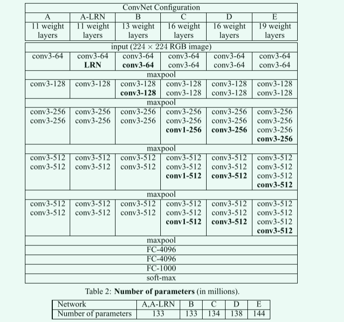

# Very Deep Convolutional Networksfor Large-Scale Image Recognition(VGGNet)

## 1 主要内容


这篇论文主要介绍了一种深度卷积神经网络模型，即`VGGNet`，该模型在`ImageNet`数据集上取得了很好的成绩。`VGGNet`的主要贡献是提出了一种可以通过增加网络深度来提高性能的方法，即通过堆叠多个`3x3`的卷积层来代替一个大的卷积层，这样可以减少参数数量，同时提高网络的非线性表达能力。`VGGNet`的网络结构非常简单，只包含卷积层和池化层，没有使用任何正则化方法，如`Dropout`等。

## 2 用于大规模图像识别的极深卷积网络(`VGGNet`)

### 2.1 主要创新点

《`Very Deep Convolutional Networks for Large-Scale Image Recognition`》的主要内容可以总结为以下几点：

1. 提出了一种新的深度卷积神经网络结构`VGGNet`，该结构采用了多个卷积层和池化层，可以有效地提取图像的特征。`VGGNet`的深度达到了`16`层或`19`层，比以往的方法更深，可以更好地捕捉图像的复杂特征。

2. 在`ImageNet`数据集上进行训练，`VGGNet`在图像分类任务上取得了非常好的表现，超过了以往的方法。在`2014`年的`ImageNet`图像分类挑战中，`VGGNet`取得了第一名的成绩，分类误差率为`7.3%`。

3. 提出了一些优化技巧，如使用小卷积核、使用重叠池化等，可以进一步提高网络的性能。这些技巧可以减少网络参数数量，降低过拟合风险，提高网络的泛化能力。

4. 通过实验验证了深度卷积神经网络在图像分类任务中的有效性，并探讨了网络深度对性能的影响。实验结果表明，网络深度越深，性能越好，但同时也会增加训练时间和计算资源的需求。

综上所述，该论文的主要贡献是提出了一种新的深度卷积神经网络结构`VGGNet`，并通过实验验证了其在图像分类任务中的有效性和优越性，同时也探讨了网络深度对性能的影响，为深度学习在计算机视觉领域的应用提供了重要的参考。

### 2.2 `VGGNet`主要描述

#### 2.2.1 小卷积核

在`VGGNet`中，作者使用小卷积核，即`3x3`大小的卷积核进行卷积操作，同时设置`stride=1`进行卷积操作。在填充方面，论文采取`same`填充方法，使经过卷积后的特征图与卷积前的大小一致。

通过小卷积核可以进一步减少网络参数数量(由于卷积神经神经网络中卷积核是参数共享的，因此当卷积核越小，参数数量就越少)。使用小卷积核，能够更好的提取图像上的特征。另一方面小卷积核相当于需要进行更多的非线性映射，可以增加拟合能力。

#### 2.2.2 小池化核

在`VGGNet`中，于卷积核类似，使用了小池化核，相较于`AlexNet`的的`3x3`的池化核，`VGGNet`全部采用`2x2`的池化核。

与`AlexNet`不同的是，`VGGNet`在采用小池化核的同时，并没有采用交叠池化，而是将池化层的步幅设置为`stride=2`。

#### 2.2.3 激活函数

在`VGGNet`中，除了最后一层，其他层都使用`Relu`激活函数。

#### 2.2.4 关于局部归一化探讨

在`VGGNet`中，作者通过加入局部归一化操作进行对比发现，局部归一化对于识别的准确度并没有明显的提升，因此在后面的网络结构中，并没有使用局部归一化。

#### 2.2.5 `VGGNet`网络模型



上图是`VGGNet`的对应网络结构核不同网络结构所具有的参数数目，其中最为令人瞩目的是`VGG16`和`VGG19`，他们的网络深度达到了前所未见的高度，同时，作者在该实验中发现，提高神经网络深度过程中，神经网络的能力也有明显的提高。

>其中`convh-i`其中的`h`指感受野大小，即卷积核大小，`i`表示输出特征图数量。

>当然，这是在一定限度下，目前的研究表明，依靠不断地加深神经网络的深度并不能持久有效的提高性能。在神经网络深度达到一定深度时，继续增加神经网络的深度可能会起到反面的效果。

#### 2.2.6 训练相关设置

**优化器的选择**

在优化器上，`VGGNet`使用具备动量梯度下降的方式进行训练，其中动量设置为`0.9`，`weigth_decay=0.0005`(原论文是$5\cdot 10^{-4}$)。

初始学习率设置为`0.01`，当验证集准确度不再提高时，学习速度降低`10`倍，即此时学习率为`0.001`.

**全连接层的Droupout设置**

为了使网络更具鲁棒性，在`VGGNet`中，全连接层的前两层使用`Droupout`，同时`dropout ratio`设置为`0.5`。

### 2.3 `VGG16`和`VGG19`的代码实现

下面根据上图描述的神经网络结构，进行`VGG16`和`VGG19`的网络结构编写。

```py
import torch.nn as nn
import torch


class VGG(nn.Module):
    def __init__(self, features, num_classes=1000, init_weights=False):
        super(VGG, self).__init__()
        # 特征提取网络--卷积层
        self.features = features
        # 分类网络--全连接层
        self.classifier = nn.Sequential(
            nn.Dropout(p=0.5),
            nn.Linear(512*7*7, 4096),
            nn.ReLU(True),
            nn.Dropout(p=0.5),
            nn.Linear(4096, 4096),
            nn.ReLU(True),
            nn.Linear(4096, num_classes)
        )
        # 初始化权重
        if init_weights:
            self._initialize_weights()

    def forward(self, x):
        x = self.features(x) # N*3*224*224
        x = torch.flatten(x, start_dim=1) # 展平N*512*7*7
        x = self.classifier(x) # N*512*7*7
        return x

    def _initialize_weights(self):
        for m in self.modules():
            if isinstance(m, nn.Conv2d):
                nn.init.xavier_uniform_(m.weight) # 该方法也被称为glorot的初始化
                if m.bias is not None:
                    nn.init.constant_(m.bias, 0) # 偏值置为0
            elif isinstance(m, nn.Linear):
                nn.init.xavier_uniform_(m.weight) # 初始化
                nn.init.constant_(m.bias, 0) # 偏值置为0


# 特征提取网络--卷积层和池化层
def make_features(cfg: list):
    layers = []
    in_channels = 3
    for struct in cfg:  # 遍历列表
        if struct == "M":  # 池化层
            layers += [nn.MaxPool2d(kernel_size=2, stride=2)]
        else:  # 卷积层
            conv2d = nn.Conv2d(in_channels, struct, kernel_size=3,  padding="same")
            layers += [conv2d, nn.ReLU(True)]
            in_channels = struct  # 下一层的输入通道数，是上一层的输出
    return nn.Sequential(*layers)


# 自行选择用vgg的哪个模型，这里使用vgg16
def vgg(model_name="vgg16", **kwargs):
    # vgg字典
    cfgs = {
        'vgg11': [64, 'M', 128, 'M', 256, 256, 'M', 512, 512, 'M', 512, 512, 'M'],
        'vgg13': [64, 64, 'M', 128, 128, 'M', 256, 256, 'M', 512, 512, 'M', 512, 512, 'M'],
        'vgg16': [64, 64, 'M', 128, 128, 'M', 256, 256, 256, 'M', 512, 512, 512, 'M', 512, 512, 512, 'M'],
        'vgg19': [64, 64, 'M', 128, 128, 'M', 256, 256, 256, 256, 'M', 512, 512, 512, 512, 'M', 512, 512, 512, 512, 'M'],
    }
    try:
        cfg = cfgs[model_name] # 得到vgg16对应的列表
    except:
        print("Warning: model number {} not in cfgs dict!".format(model_name))
        exit(-1)
    # 搭建模型
    model = VGG(make_features(cfg), **kwargs)
    return model
```

>>使用`MNIST`数据集进行基本测试的完整`code`见对应文件夹下的`code`文件夹内！

## 3 参考文献
[1] Simonyan K ,  Zisserman A . Very Deep Convolutional Networks for Large-Scale Image Recognition[J]. Computer Science, 2014.